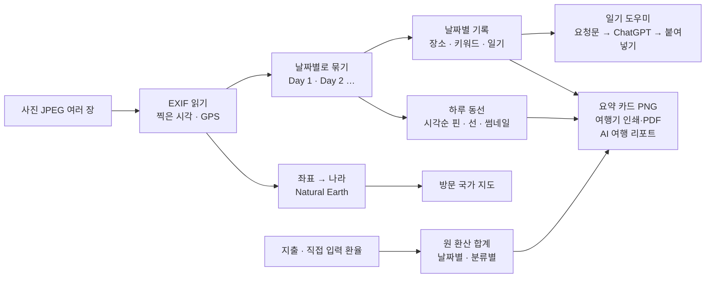

# JOURNAL — 프로젝트 기획서

| 항목 | 내용 |
|---|---|
| 리포 | data09-24 |
| 제출자 | 김세이 |
| 직무·소속 | 외자재 운영 담당 (data09-12 「외자재 운영관리 Agent」와 같은 수강생의 두 번째 과제). 이 과제는 업무 밖 생활 주제입니다 |
| 과정 | 현장 데이터 디지털화 전문가과정 1차수 |
| 작성일 | 2026-09-29 |
| 문서 상태 | 초안 v0.1 — 패들릿 기능 지도(Feature Map) 요약, 1단계 = 사진 날짜·위치 자동 정리·동선 지도·방문 국가·경비·일기 도우미·요약 카드와 PDF, 2단계 = Vision AI 자동 분류·음성·경로 최적화·취향 분석과 추천·공유와 계정 |

이 문서는 제출자가 패들릿 「프로젝트 기획 - 김세이(2)」에 올린 글(2026-09-29 14:36, 14:46 수정, 제목 「JOURNAL」)을 과정 기획서 형식(10장)으로 정리한 것입니다.
원문은 「구분 · 주요 기능 · AI 활용 상세」 표로 된 기능 지도이고(`docs/source/패들릿_제출_원문.md`), 첨부 파일은 없습니다.
기능이 많아 **1단계는 「사진을 넣으면 날짜·장소가 저절로 정리되는 여행 기록」의 뼈대만 간결하게** 만들고, 외부 AI·서버·계정이 필요한 기능은 이유를 적어 2단계로 미뤘습니다.

## 1. 추진 배경과 현안

- 여행을 다녀오면 사진은 수백 장인데 **언제 어디였는지, 어떤 순서로 다녔는지, 얼마를 썼는지**가 흩어집니다. 사진첩·메모·가계부·지도 앱이 따로 놀아 여행기를 쓰려면 다시 모아야 합니다.
- 원문의 목표는 「**여행 전 계획부터 여행 후 기록까지 모두 정리**」, 그리고 「친구·지인·가족과 함께 기록하는 **공동 여행 기록일지**」입니다.
- 사진 파일에는 이미 **찍은 시각과 GPS 위치(EXIF)** 가 들어 있는 경우가 많습니다. 이것만 잘 읽어도 날짜별 정리와 동선 지도는 자동으로 됩니다.

## 2. 목표

### 2.1 최종 목표 (원문 기능 지도)

| 구분 | 원문 기능 |
|---|---|
| 자동 기록 & 정리 | 사진 기반 위치·일자 자동 태깅 · 음성/텍스트 기반 여행 일기 생성 · Vision AI(풍경·음식·명소 인식, 위치·카테고리 자동 분류) · LLM(메모·키워드 → 블로그 스타일 일기) |
| 지도 및 일정 시각화 | 동선 시각화(Interactive Map) · 방문 장소 핀과 썸네일 · 경로 추천/최적화 |
| 맞춤형 여행 피드백 | 여행 스타일·취향 분석 · 다음 여행지/장소 추천 · 개인화 AI 에이전트(과거 기록으로 비슷한 분위기 장소·음식점 추천) |
| 소셜 및 공유 | 요약 카드/인포그래픽 · 여행기 PDF/템플릿 export |
| 기록 보관 | 여행 지도(방문한 국가·도시) · 여행 앨범·여행별 기록 · 여행 경비·지출 내역 · AI 여행 리포트·추억 요약 |
| 확장 | 여행 전 계획 · 공동 여행 기록일지 |

### 2.2 1단계 목표 (이 리포)

**사진을 고르면 → 날짜별로 묶이고 → 지도에 동선이 그려지고 → 방문 나라가 칠해지는 것**을 가장 먼저 되게 합니다. 그 위에 일기·경비·요약 카드를 얹습니다.

- 설치 없이 도는 정적 웹. `index.html` 을 더블클릭해도(file://) 열리고, 인터넷이 없어도 지도가 보입니다(외부 지도 타일·CDN 없음).
- **사진은 이 브라우저 밖으로 나가지 않습니다.** 원본은 읽기만 하고, 작게 줄인 미리보기만 브라우저 저장소(IndexedDB)에 둡니다.
- AI 는 과정 표준대로 「요청문 만들기 → ChatGPT·Copilot 에 붙여넣기 → 답 붙여넣기」 반자동이 기본이고, 본인 OpenAI 키를 넣으면 바로 받아 오는 자동 모드를 선택으로 둡니다.

## 3. 보유 데이터

| 데이터 | 형태 | 비고 |
|---|---|---|
| 여행 사진 | JPEG 의 EXIF — 찍은 시각(DateTimeOriginal), 시간대(OffsetTimeOriginal), GPS 위도·경도 | 수강생 실제 사진은 받지 않았습니다. 1단계 검증은 **가짜 EXIF 를 넣은 합성 이미지 10장**(`samples/`)으로 했습니다 |
| 세계 지도 | Natural Earth 1:110m 나라 경계(공개 도메인) | `vendor/world-110m.js` 로 변환해 넣음(133KB). 방문 나라 칠하기와 좌표 → 나라 판정에 씀 |
| 일기·메모·경비 | 사용자가 입력 | 환율도 사용자가 입력(영수증·카드 명세서 기준). 실시간 환율 API 는 쓰지 않음 |

## 4. 해결 방안 개요

| 단계 | 내용 |
|---|---|
| EXIF 읽기 | JPEG 의 APP1(Exif) 블록을 직접 읽는 작은 파서(`js/exif.js`, 외부 라이브러리 없음). 리틀·빅엔디언 모두, 잘린 파일은 오류 없이 「없음」 |
| 날짜 묶기 | 카메라 현지 시각의 날짜로 하루씩(시간대 변환 없음). EXIF 가 없으면 파일 날짜로 짐작하고, 그 날짜가 여행 기간 밖이면 「날짜 확인」 목록으로 보냄 |
| 동선 | 하루 안의 위치 있는 사진을 찍은 시각 순으로 이음. 30m 안에서 연달아 찍은 곳은 한 점. 거리는 두 점 사이 직선거리(하버사인) |
| 나라 판정 | 지도 경계 안이면 그 나라, 해안선이 거칠어 바다로 빠진 좌표는 1도 안의 가장 가까운 나라, 지도에 모양이 없는 작은 나라(싱가포르·홍콩 등)는 따로 |
| 경비 | 항목마다 `금액 × 환율` 을 원 단위로 반올림한 뒤 더함. 환율이 없는 통화는 합계에서 빼고 알려 줌 |

## 5. 주요 기능 — 1단계 / 2단계

| 원문 기능 | 단계 | 1단계에서 한 것 / 미룬 이유 |
|---|---|---|
| 사진 기반 위치·일자 자동 태깅 | **1단계** | EXIF 날짜·GPS 를 읽어 날짜별로 묶고, 좌표로 나라를 찾아 여행에 더함. 여행 기간이 비어 있으면 사진 날짜로 채움. 「사진으로 날짜별 기록 만들기」는 날마다 기록을 만들고 장소 칸에 나라 이름, 시각에 첫 사진 시각을 미리 채움 |
| 음성/텍스트 기반 여행 일기 생성 | **1단계(텍스트)** · 2단계(음성) | 텍스트: 키워드·메모 → 일기 도우미. 음성: 아래 이유로 2단계. 지금도 휴대폰 키보드의 마이크(받아쓰기)로 키워드 칸에 말로 넣을 수 있습니다 |
| LLM — 메모·키워드로 블로그 스타일 일기 | **1단계** | 요청문에 날짜·여행 며칠째·장소·그날 들른 곳·사진 장수와 시간대·이동 거리·키워드를 넣고 「메모에 없는 사실은 지어내지 말 것」 조건을 붙임. 형식 3가지(블로그·담백한 일기·짧은 기록), 분량 3가지. 답의 「제목:」 줄을 떼어 기록 제목으로 씀 |
| Vision AI — 풍경·음식·명소 인식, 카테고리 자동 분류 | **2단계** | 사진을 외부 AI 로 보내야 합니다(얼굴·위치가 담긴 개인 사진, 장당 비용·대기 시간). 1단계는 「사진은 브라우저 밖으로 나가지 않는다」를 원칙으로 했습니다(10장 질문 6) |
| 동선 시각화 (Interactive Map) | **1단계** | 외부 지도 없이 SVG 로 그린 지도에 날짜별 색 동선, 번호 핀, 축척 막대. 「여행 전체 / Day N」 보기 전환, 핀을 누르면 사진·시각·좌표·그날 기록 |
| 방문 장소 핀과 썸네일 | **1단계** | 핀 옆에 사진 썸네일(켜고 끄기). 앨범에는 날짜별로 사진 미리보기 |
| 경로 추천/최적화 | **2단계** | 효율적인 순서를 제안하려면 실제 이동 시간(도로·대중교통)이 필요합니다. 직선거리만으로 순서를 추천하면 강·산·교통편을 무시한 엉뚱한 답이 나와 1단계에서는 **실제로 다닌 순서와 직선거리**만 보여 줍니다 |
| 여행 스타일·취향 분석, 다음 여행지 추천, 개인화 AI 에이전트 | **2단계** | 여러 번의 여행 기록과 장소 분류(Vision 또는 직접 태그), 추천할 장소 자료(외부 장소 DB·지도 API)가 있어야 합니다. 1단계는 그 바탕 데이터(여행·날짜별 기록·방문 국가·지출 분류)를 쌓습니다 |
| 요약 카드 / 인포그래픽 | **1단계** | 1080×1080 PNG — 여행 이름·기간·나라·도시·동선 지도·사진 수·일기 수·이동 거리·경비(넣고 빼기) |
| 여행기 PDF / 템플릿 export | **1단계(템플릿 1종)** | 「여행기 인쇄」 — AI 리포트·동선 지도·날짜별 일기와 사진·경비 표를 한 문서로 모아 인쇄 창을 엽니다. 「PDF로 저장」을 고르면 PDF. 여러 템플릿은 2단계 |
| 여행 지도 — 방문한 국가와 도시 | **1단계** | 모든 여행을 모아 세계 지도에 방문 나라 칠하기(작은 나라는 점), 사진 위치 점, 방문 나라·도시 목록 |
| 여행 앨범, 여행별 기록 | **1단계** | 여행마다 날짜별 기록과 앨범. 날짜 없는 사진은 「날짜 확인」 목록에서 날짜를 정해 옮김 |
| 여행 경비, 지출 내역 | **1단계** | 날짜·금액·통화(15종)·분류(숙박·교통·식비·관광·입장·쇼핑·기타)·메모. 환율은 직접 입력. 여행·날짜별·분류별 합계, 통화별 원래 금액 |
| AI 여행 리포트 및 추억 요약 | **1단계** | 여행 전체(기간·나라·기록 수·이동 거리·경비·날짜별 일기)로 리포트 요청문 → 붙여넣기 → 인쇄용 여행기 맨 앞에 들어감 |
| 여행 전 계획 | **2단계** | 계획 일정과 실제 동선을 비교하는 화면이 필요합니다. 1단계도 기간·나라·도시·메모를 먼저 적어 둘 수는 있습니다(10장 질문 7) |
| 공동 여행 기록일지 (친구·지인·가족) | **2단계** | 계정·서버 저장·사진 저장소·함께 쓰는 권한이 필요합니다. DB 스키마(`supabase/schema.sql`, 본인 행만 RLS)와 로컬 검증 하네스는 준비해 두었습니다. 1단계는 JSON 백업 파일로 주고받을 수 있습니다 |
| 소셜 공유 | **2단계** | 링크 공유는 계정·서버가 필요합니다. 1단계는 PNG 카드와 PDF |

**1단계에서 줄인 규칙** (간결하게 가기 위한 해석 — 10장에서 확인 요청)

- **장소 이름은 자동으로 붙이지 않습니다.** 좌표 → 「도톤보리」 같은 장소 이름(역지오코딩)은 외부 지도 API(키·요금)나 큰 장소 자료가 필요합니다. 1단계는 **나라까지 자동**, 장소 이름은 직접 적습니다(10장 질문 3).
- **시간대는 바꾸지 않습니다.** 카메라가 적은 현지 시각의 날짜로 묶습니다. 비행기로 날짜변경선을 넘는 여행에서도 「그곳에서의 날짜」가 유지됩니다.
- **지도는 1:110m(대략적인) 세계 지도**라 도시 단위로 확대하면 해안선이 거칩니다. 핀·동선 위치는 사진 좌표 그대로라 정확합니다.
- **아이폰 HEIC 사진은 읽지 않습니다.** 브라우저가 HEIC 를 거의 열지 못합니다. JPEG 로 내보내거나 카메라를 「높은 호환성」으로 두면 됩니다(10장 질문 2).

## 6. 기대 산출물

1. **JOURNAL 웹 도구(1단계)** — https://aebonlee.github.io/data09-24/ (「예시 여행 불러오기」로 가상의 간사이 3박 4일 + 지난 여행 2개를 바로 볼 수 있음)
2. **합성 예시 사진 10장** — `samples/` (가짜 EXIF: 명소의 대략 좌표·가상 일정, 위치 없는 사진·EXIF 없는 사진 포함) · 만드는 스크립트 `scripts/make-samples.mjs`
3. **로직 테스트** — `test/logic.test.mjs`: EXIF 읽기·날짜 묶기·동선 순서·경비 환산·나라 판정·프롬프트·백업 검사
4. **DB 스크립트** — `supabase/schema.sql`(여행·기록·사진·지출, 본인 행만 RLS, 재실행 안전)과 로컬 검증 하네스(`scripts/sqltest/`)

## 7. 기술 구성

| 과정 도구 | 이 프로젝트에서 쓰는 곳 |
|---|---|
| DAY1 암묵지 자산화·전략기획 | 기능 지도를 1단계(데이터가 저절로 쌓이는 뼈대)와 2단계(그 데이터를 쓰는 AI)로 나눔 |
| DAY2 코랩(Python)·바이브코딩 | 도구 제작 — 이 프로젝트의 중심 |
| DAY3 멀티모달 비정형 정보화 | 사진(비정형) → EXIF 날짜·좌표(정형). 2단계 Vision AI 분류 후보 |
| DAY4 RAG | (2단계 후보) 과거 여행 일기를 근거로 비슷한 장소를 추천하는 개인화 에이전트 |
| DAY5 Make 자동화 | (2단계 후보) 공유 폴더에 올린 사진을 받아 여행별로 정리 |

- 정적 웹(HTML·CSS·일반 스크립트). 외부 CDN·라이브러리 없음. 지도 자료만 `vendor/` 에 넣음(출처·라이선스 `vendor/world-110m-LICENSE.txt`).
- 저장: 여행·기록·경비·사진 정보는 localStorage `data09-24.db`, 사진 미리보기(긴 변 480px JPEG)는 IndexedDB. OpenAI 키는 따로(백업에 안 들어감).
- 계산 함수(`js/logic.js`, `js/exif.js`)는 화면과 분리된 순수 함수라 Node 에서 그대로 테스트합니다.

## 8. 개발 단계

### 1단계 — 사진 자동 정리 + 지도 + 경비 + 일기 도우미 + 내보내기 (완료, 2026-09-29)

- EXIF 파서, 날짜 묶기, 동선, 좌표 → 나라, 경비 환산, 프롬프트, 백업 검사와 테스트
- 여행·기록·앨범·동선 지도·방문 지도·경비·요약 카드·여행기 인쇄·AI 리포트·백업 화면

### 2단계 — AI 인식·추천·함께 쓰기

- [ ] Vision AI 사진 분류(풍경·음식·명소 …) — 사진을 보낼지 사용자가 장마다 고르는 방식, 본인 키
- [ ] 장소 이름 자동(역지오코딩) — 외부 지도 API 또는 도시 목록 자료
- [ ] 음성 입력 — 브라우저 음성 인식 지원 범위 확인 후
- [ ] 경로 추천 — 실제 이동 시간 자료(지도·교통 API)와 함께
- [ ] 취향 분석·다음 여행지 추천·개인화 에이전트 — 여러 여행 기록이 쌓인 뒤, 과거 일기를 근거로(RAG)
- [ ] 계정·동기화·공동 여행 기록 — `supabase/schema.sql` 연결, 사진은 private Storage 버킷, 함께 쓰는 사람 권한
- [ ] 여행 전 계획(계획 일정 ↔ 실제 동선 비교), 여행기 템플릿 여러 종, 링크 공유
- [ ] HEIC 사진 지원 검토

## 9. 기대 효과

- **정리 시간 0분에 가깝게** — 사진만 고르면 날짜별 앨범·동선·방문 나라가 저절로 생깁니다. 사람은 장소 이름과 한두 줄 메모만 적으면 됩니다.
- **여행기 쓰기의 문턱을 낮춤** — 키워드 몇 개로 일기 초안을 받고, 여행이 끝나면 리포트·요약 카드·PDF 가 한 번에 나옵니다.
- **돈과 동선이 한 화면에** — 날짜별 지출과 이동을 같이 보며 다음 여행 예산을 세울 수 있습니다.
- **개인 사진 보호** — 1단계는 사진을 어디에도 올리지 않아 가족·친구 얼굴이나 집 근처 위치가 밖으로 나가지 않습니다.

## 10. 확인 필요 사항 (수강생께)

1. **이름** — 원문 제목 그대로 「JOURNAL」, 부제 「사진으로 정리하는 여행 기록일지」로 했습니다. 괜찮은가요?
2. **휴대폰 사진 형식** — 주로 아이폰(HEIC)인가요, 안드로이드(JPEG)인가요? 아이폰이면 「JPEG 로 내보내기」 또는 「높은 호환성」 설정이 필요하고, 불편하면 2단계에서 HEIC 지원을 검토하겠습니다.
3. **장소 이름 자동** — 1단계는 나라까지만 자동이고 「도톤보리」 같은 장소 이름은 직접 적습니다. 자동으로 원하시면 ① 외부 지도 API(키·요금, 좌표가 밖으로 나감) ② 도시 이름 목록만 넣기(오프라인, 도시 단위까지) 중 어느 쪽이 좋을까요?
4. **사진 보관** — 1단계는 작은 미리보기(긴 변 480px)만 브라우저에 저장하고 원본은 휴대폰·PC 에 그대로 둡니다. 인쇄용 여행기에 더 큰 사진이 필요한가요?
5. **공동 여행 기록일지** — 누구와 함께 쓰나요(가족·친구 몇 명)? 같은 여행에 각자 사진과 일기를 올리고 한 화면에서 보는 방식이면 될까요? (2단계 계정 설계에 필요)
6. **Vision AI 로 사진 보내기** — 사진을 외부 AI(OpenAI 등)로 보내 분류하는 것에 동의하시나요? 분류 이름은 풍경·음식·명소 외에 무엇이 필요할까요(숙소·교통·사람 등)?
7. **여행 전 계획** — 계획한 일정표와 실제 동선을 나란히 비교하고 싶으신가요, 아니면 가고 싶은 곳 목록 정도면 될까요?
8. **경비** — 기준 통화를 원화로 고정했습니다. 함께 간 사람과 나눠 내는 정산(누가 얼마를 더 냈나)도 필요한가요?
9. **요약 카드·여행기** — 정사각형(1080×1080) 카드 한 종과 인쇄용 여행기 한 종으로 시작했습니다. 원하는 모양(세로형 스토리, 블로그용 등)이 있으면 알려 주세요.

## 부록. 제출 원문 요약

| 출처 | 게시물 | 내용 |
|---|---|---|
| 패들릿 「프로젝트 기획 - 김세이(2)」 (2026-09-29 14:36, 14:46 수정) | `docs/source/패들릿_제출_원문.md` | 제목 「JOURNAL」, 1. 핵심 기능 구성(Feature Map) 표 — 자동 기록 & 정리 · 지도 및 일정 시각화 · 맞춤형 여행 피드백 · 소셜 및 공유, 표 아래 목록(여행 지도·앨범·경비·AI 리포트), 「여행 전 계획부터 여행 후 기록까지」, 「공동 여행 기록일지」. 첨부 없음 |
